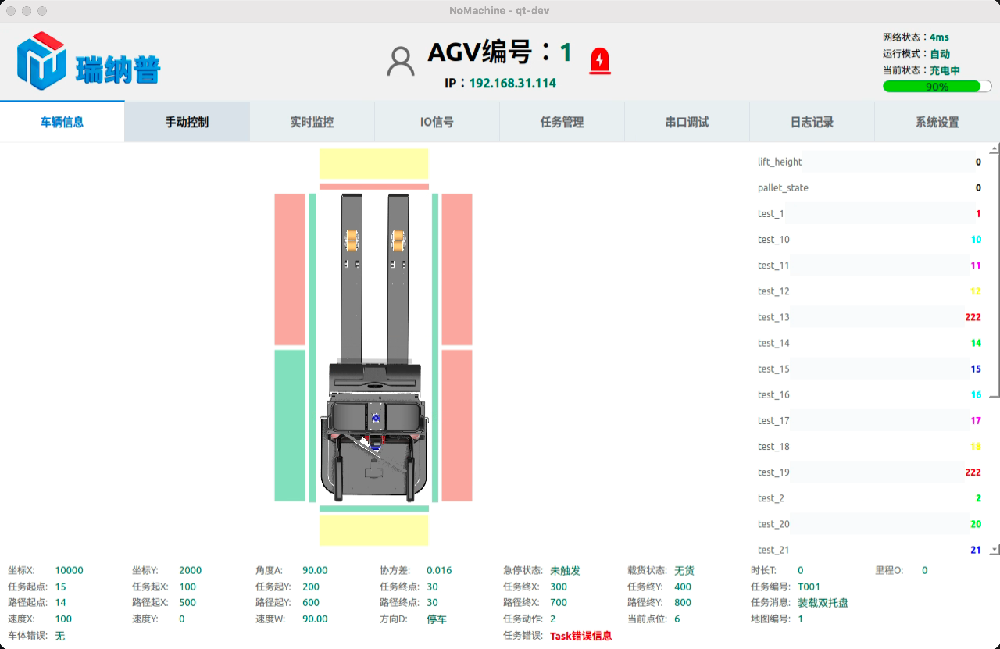
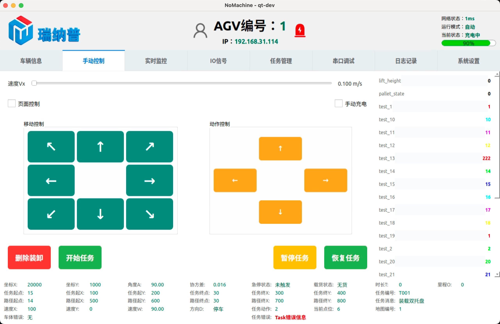
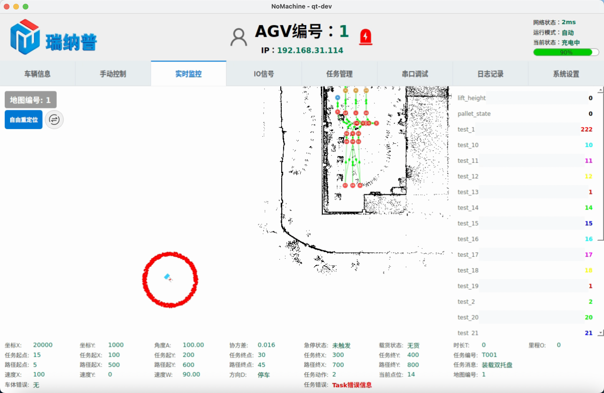
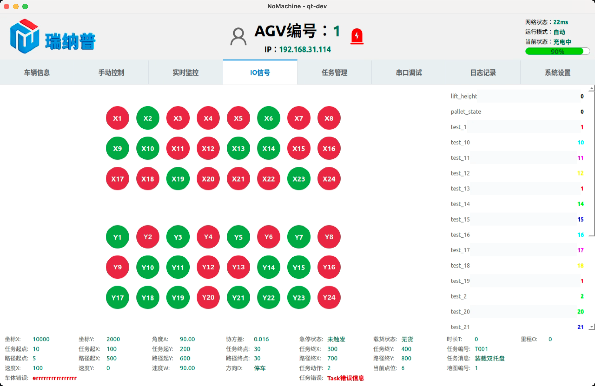
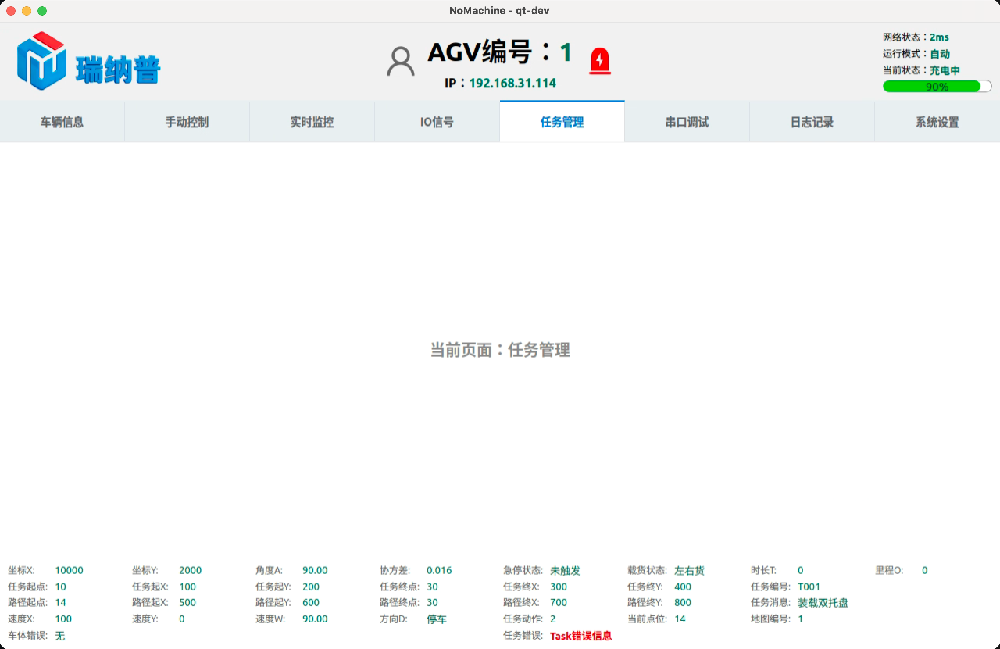
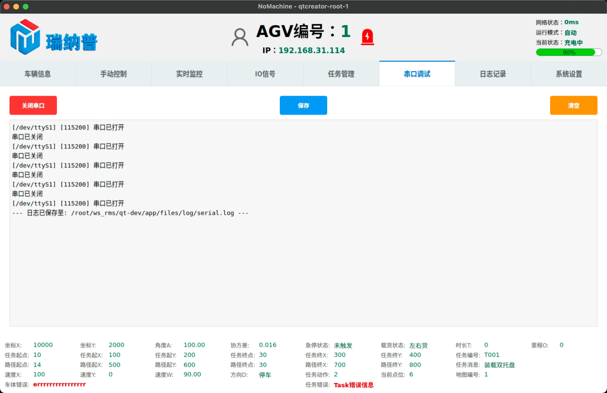
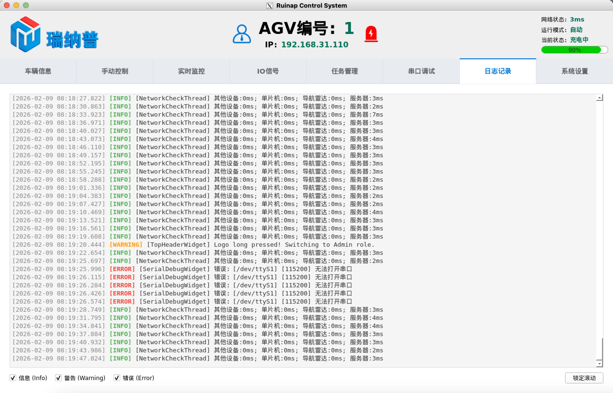
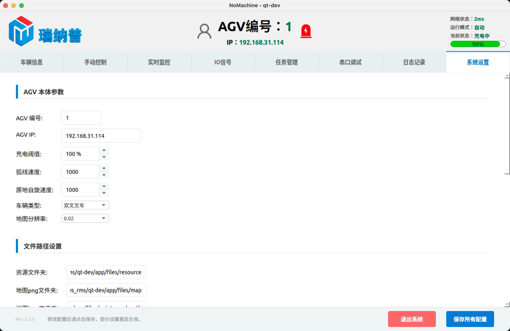

# This is a README

## 界面预览

&nbsp;&nbsp;&nbsp;
&nbsp;&nbsp;&nbsp;
&nbsp;&nbsp;&nbsp;
&nbsp;&nbsp;&nbsp;
&nbsp;&nbsp;&nbsp;
&nbsp;&nbsp;&nbsp;
&nbsp;&nbsp;&nbsp;
&nbsp;&nbsp;&nbsp;

## 20260204 V1.2.2

* 新增系统参数栏【其他通讯设置】，并新增两个参数 单片机串口、单片机波特率，可在系统设置中修改
* 新增 SerialDebugWidget 串口界面
* 串口调试界面通过系统设置的单片机串口、单片机波特率来获取串口参数
* 串口调试只有【打开/关闭串口】、【清空】两个按钮，以及主显示区域
* 串口调试中需要接收到 \r\n 字符才会执行换行并显示
* 串口调试中设置主显示区域上限 2000 行

## 20260203 V1.2.1

* 新增 admin.svg operator.svg 图标，用于区分普通用户和管理员
* ConfigManager 中新增当前用户权限，该参数不从配置文件读取，打开软件时默认为 operator
* 新增 PermissionManager 来管理系统的用户权限
* 新增 GlobalEventFilter 来实现全局的事件过滤器
* main 中实现创建全局的事件过滤器
* TopHeaderWidget 中新增交互逻辑，长按 LOGO 3s 可切换至管理员模式，且屏幕无操作后，会在 5s 内退回普通用户

## 20260202 V1.2.0

* MonitorWidget 瘦身，提取出 MapDataManager、MonitorInteractionHandler、RelocationController
* MapDataManager 处理加载调度地图数据
* MonitorInteractionHandler 处理鼠标和触摸屏交互逻辑
* RelocationController 处理重定位相关的交互逻辑

## 20260202 V1.1.9

* 开发重定位功能，支持鼠标 + 触屏操作，通过发布 ros 节点 /baseinipose 来进行交互
* PointCloudLayer 优化，在重定位模式下锁定数据更新，将点云坐标转换为以车体为中心，并响应重定位的移动和旋转
* AgvLayer 提供 getPos 和 getAngle 方法
* AgvData 中新增一个 requestInitialPose 重定位信号，用于转发 MonitorWidget 中发出的信号，转发至 RosBridgeClient 子线程
* MonitorWidget 中新增了对重定位功能的处理逻辑
* RosBridgeClient 中新增了发布重定位 topic 的槽函数 setInitialPose
* RelocationLayer 用于实现重定位交互的大小圆圈

## 20260130 V1.1.8

* 新增 mapJsonFolder 参数，用于配置调度点位线路地图的路径
* RosBridgeClient 子线程的创建现在转移到了 AgvData 中
* 取消了对 /scan 的订阅，现在订阅 /laser_points 来绘制雷达点云
* MonitorWidget 大改绘制逻辑且移除了对 RosBridgeClient 子线程的处理
* MonitorWidget 新增在切换地图时，对 points_and_path_x.json 文件的加载
* 创建 BaseLayer 基类，用于绘制不同的图层，在此基础上创建 GridLayer、MapLayer、PointPathLayer、AgvLayer、PointCloudLayer
* GridLayer 绘制原点处的十字标，后期可以优化扩展成网格
* MapLayer 绘制加载的 png 地图
* PointPathLayer 绘制调度地图的点位和线路
* AgvLayer 绘制 agv 本体模型，可以根据系统配置的 vehicleType 来对应不同的模型
* PointCloudLayer 绘制雷达点云数据

## 20260128 V1.1.7

* 新增系统参数 充电阈值
* AgvData 中新增 TOUCH_STATE 的内容
* 完成 手动控制 标签页的内容
* CommunicationWsClient 新增发送 TOUCH_STATE

## 20260127 V1.1.6

* 不再处理 OptionalInfoErr，不存在该字段
* 切换至 SystemSettingsWidget 时加载一次配置文件
* 不再通过 ros 订阅 topic 的 map_name 来切换地图，而是使用 AGV_STATE 中的 map_id 字段
* 提取出 BaseDisplayWidget 基类，实现统一的左右布局，左侧 3/4 为页面主内容，右侧 1/4 为 OptionalInfoWidget
* 将 VehicleInfoWidget、MonitorWidget、IoWidget 页面全部修改为使用 BaseDisplayWidget 基类

## 20260123 V1.1.5

* 系统配置新增 mapResolution 参数
* RosBridgeClient 中新增对 map_name、agv_state 的订阅与处理
* MonitorWidget 新增地图切换逻辑，并且绘制了实时的 agv 以及 点云
* AgvData 中新增备份 optionalInfo，用于可选信息的显示
* 新增 OptionalInfoWidget 组件，当前添加至 车辆信息的右侧
* 新增 IoWidget 组件，用于显示 24 个 Input 信号和 24 个 Output 信号

## 20260122 V1.1.4

* 系统配置新增了 vehicleType 和 configFolder 两个参数
* BottomInfoBar 组件中添加定时器，用于定期更新内容
* 新增 VehicleInfoWidget 组件，用于显示 车辆信息 页面，包括车体模型图片，防撞条以及避障区域，有无货物 的显示
* 有无货物的显示，根据系统的 vehicleType 判断是 左右货 还是 一个货
* TopHeaderWidget UI 区域中，右上角将 备用字段 利用，显示网络状态
* 新增 NetworkCheckThread 子线程，用于检测网络连接
* 检测网络连接时，优先检测 eth_ip.json 中的成员，如果有 ping 不通的，直接显示 xxx 离线
* 检测网络连接时，如果 eth_ip.json 中的成员都正常 ping 通，那么显示与服务器间的延迟，服务器 ip 从系统配置中读取
* 检测网络连接时，如果 eth_ip.json 中的成员都正常 ping 通，但是服务器 ping 不通，那么显示 服务器离线

## 20260121 V1.1.3

* RosBridgeClient 新增重连机制
* 新增 WebsocketClient 通用 websocket 客户端模块
* 新增 CommunicationWsClient，用于调用 WebsocketClient 实现定制化的 wsClient 业务处理，定时发送轮询请求，并将接收到的消息 emit
* 新增 AgvData，单例模式，作为 Agv 相关参数的全局变量。包含 AgvInfo、optionalINFO、AGV_TASk。并实现解析 CommunicationWsClient 接收到的消息
* 在 TopHeaderWidget UI 区域中，通过定时器定时更新，根据最新的 AgvData 对应内容来更新。可以设置为较低频率

## 20260120 V1.1.2

* 新增了 BottomInfoBar，用于在部分 tab 标签页底部显示信息栏
* 删除了 RosBridgeClient 中对 map 的订阅与交互
* 现在直接通过 map 的指定文件夹来加载 png 图片
* ConfigManager 中添加了线程安全操作，autmic 以及 QReadWriteLock

## 20260119 V1.1.1

* 删除了原先的 RosDataWorker 线程，将 RosBridgeClient 改为子线程运行，并将逻辑处理也放在该线程中

## 20260116 V1.1.0

* 新增 Version.h 来设置版本号
* 优化 TopHeaderWidget 组件
* 新增 light.svg 图标